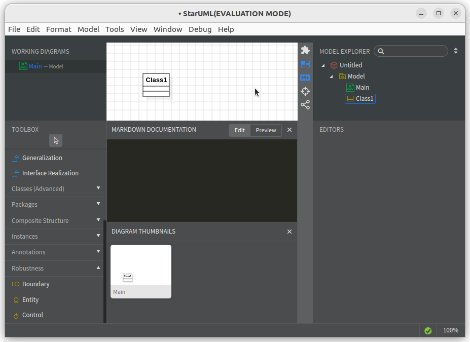

# Instalasi Star UML
StarUML adalah aplikasi perancangan perangkat lunak berbasis model yang digunakan untuk membuat diagram UML (Unified Modeling Language), seperti class diagram, use case diagram, activity diagram, dan lain-lain. Aplikasi ini mendukung pendekatan pemodelan berbasis MDA (Model-Driven Architecture), serta menyediakan antarmuka modern dan dukungan plugin untuk pengembangan sistem perangkat lunak skala kecil hingga besar. StarUML populer di kalangan mahasiswa dan profesional untuk dokumentasi dan desain sistem.
## Langkah-Langkah Instalasi
### 1. Unduh File Instalasi Star UML
Kunjungi https://staruml.io/ kemudian unduh file instalasi untuk sistem operasi Linux.

### 2. Install Star UML
Pada terminal masuk ke direktori tempat file instalasi Star UML disimpan (biasanya terletak pada direktori Downloads), gunakan perintah berikut untuk berpindah direktori: 
```bash
cd Downloads/
```
Berikut adalah output jika telah berpindah direktori:
```bash
arie@zeno:~/Downloads$ 
```
Kemudian gunakan perintah berikut untuk melakukan instalasi Sta UML:
```bash
sudo dpkg -i StarUML_6.3.3_amd64.deb
```
Jika instalasi berhasil output baris terakhirnya akan seperti berikut:
```bash
Setting up staruml (6.3.3) ...
update-alternatives is /usr/bin/update-alternatives
update-alternatives: using /opt/StarUML/staruml to provide /usr/bin/staruml (staruml) in auto mode
Processing triggers for hicolor-icon-theme (0.17-2) ...
Processing triggers for gnome-menus (3.36.0-1ubuntu3) ...
Processing triggers for mailcap (3.70+nmu1ubuntu1) ...
Processing triggers for desktop-file-utils (0.26-1ubuntu3) ...
```
### 3. Verifikasi Instalasi
Star UML yang sudah terinstall dapat ditemukan pada menu Applications. 
Berikut adalah Star UML ketika berjalan di Ubuntu 22.04 LTS.


