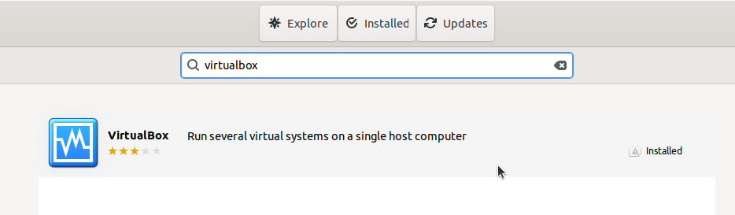
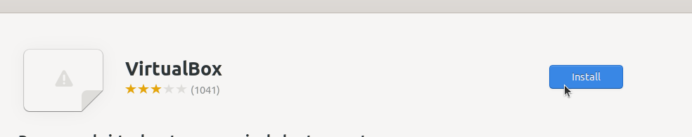
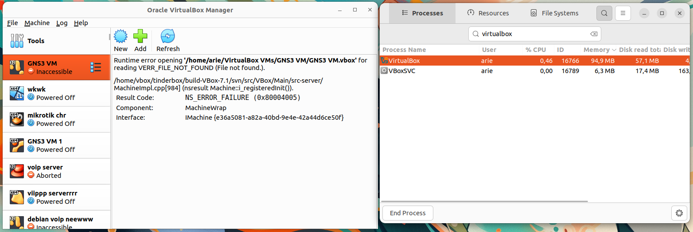

# Instalasi VirtualBox
VirtualBox adalah perangkat lunak open-source yang memungkinkan pengguna untuk menjalankan sistem operasi lain (guest OS) di dalam sistem operasi utama (host OS) secara virtual. VirtualBox mendukung berbagai sistem operasi, seperti Linux, Windows, dan macOS, sehingga pengguna dapat menjalankan banyak sistem operasi dalam satu perangkat keras fisik secara bersamaan
## Langkah-Langkah Instalasi
### 1. Buka Ubuntu Software
Untuk membuka ubuntu software dapat mengklik icon ubuntu software pada menu applications.

### 2. Cari VirtualBox
Klik icon search pada pojok kiri atas ubuntu software kemudian masukkan keyword "VirtualBox".

### 3. Install VirtualBox
Pilih software yang sesuai kemudian tekan tombol install.

### 4. Verifikasi Instalasi
Tunggu hingga proses instalasi selesai, VirtualBox yang sudah terinstall dapat ditemukan pada menu Applications.
Berikut adalah VirtualBox ketika berjalan di Ubuntu 22.04 LTS.

