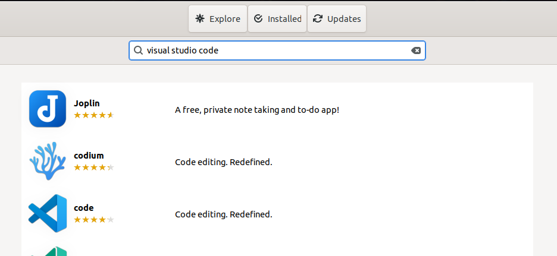
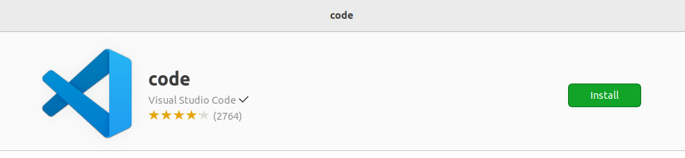
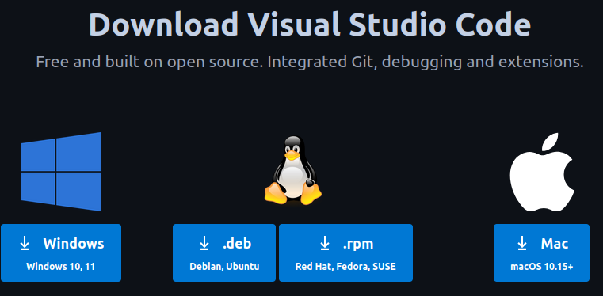
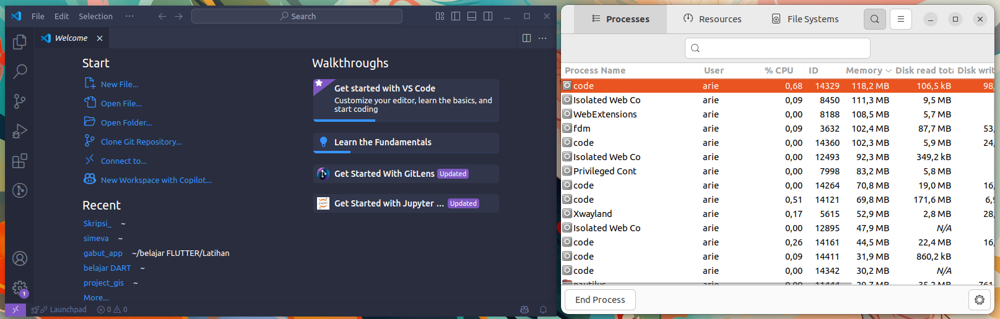

# Instalasi Visual Studio Code
Visual Studio Code (VS Code) adalah editor kode sumber yang ringan namun kuat yang dikembangkan oleh Microsoft. Editor ini populer di kalangan pengembang perangkat lunak karena mendukung berbagai bahasa pemrograman, memiliki ekstensi yang kaya, serta fitur seperti debugging, terminal bawaan, dan integrasi Git (Microsoft, 2023).
## Langkah-Langkah Instalasi
### 1. Buka Ubuntu Software
Untuk membuka ubuntu software dapat mengklik ikon ubuntu software pada menu applications.


### 2. Cari Visual Studio Code
Klik icon search pada pojok kiri atas ubuntu software kemudian masukkan keyword "Visual Studio Code".




### 3. Install Visual Studio Code
Pilih software yang sesuai kemudian tekan tombol install.




### 4. Verifikasi Instalasi
Tunggu hingga proses instalasi selesai, Visual Studio Code yang sudah terinstall dapat ditemukan pada menu Applications.

## Instalasi Visual Studio Code dengan CLI
### 1. Unduh File Instalasi Visual Studio Code
Kunjungi https://code.visualstudio.com/download kemudian unduh file instalasi untuk sistem operasi ubuntu.



### 2. Install Visual Studio Code
Pada terminal masuk ke direktori tempat file instalasi visual studio code disimpan (biasanya terletak pada direktori Downloads), gunakan perintah berikut untuk berpindah direktori: 
```bash
cd Downloads/
```
Berikut adalah output jika telah berpindah direktori:
```bash
arie@zeno:~/Downloads$ 
```
Kemudian gunakan perintah berikut untuk melakukan instalasi visual studio code:
```bash
sudo dpkg -i code_1.96.4-1736991114_amd64.deb
Jika instalasi berhasil outputnya akan seperti berikut:
Setting up code (1.96.4-1736991114) ...
Processing triggers for gnome-menus (3.36.0-1ubuntu3) ...
Processing triggers for mailcap (3.70+nmu1ubuntu1) ...
Processing triggers for desktop-file-utils (0.26-1ubuntu3) ...
Processing triggers for shared-mime-info (2.1-2) ...
```
### 3. Verifikasi Instalasi
Visual Studio Code yang sudah terinstall dapat ditemukan pada menu Applications. 
Visual studio code yang sudah terinstall juga dapat dijalankan dengan perintah berikut pada terminal:
```bash
code 
```
Kemudian jendela visual studio code akan muncul.
Berikut adalah Visual Studio Code ketika berjalan di Ubuntu 22.04 LTS.


