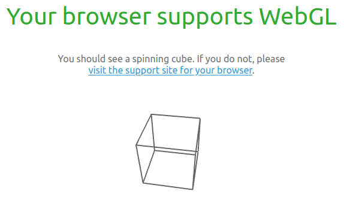
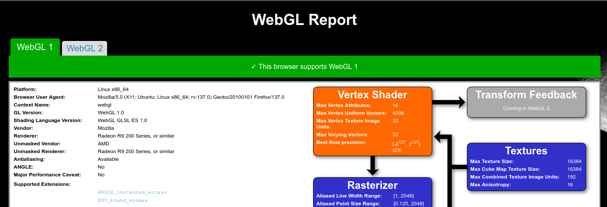

# Instalasi WebGL
WebGL (Web Graphics Library) adalah API berbasis JavaScript yang digunakan untuk merender grafis 2D dan 3D interaktif di dalam browser web, tanpa memerlukan plugin tambahan. WebGL memanfaatkan kemampuan GPU (Graphics Processing Unit) melalui standar OpenGL ES.
## Langkah-Langkah Instalasi
### 1. Pastikan dan Driver Terpasang
Jalankan perintah berikut untuk memeriksa driver GPU:
```bash
lspci -k | grep -A 2 -i "vga"
Berikut adalah output jika driver GPU terpasang:
5:00.0 VGA compatible controller: Advanced Micro Devices, Inc. [AMD/ATI] Picasso/Raven 2 [Radeon Vega Series / Radeon Vega Mobile Series] (rev c4)
Subsystem: Acer Incorporated [ALI] Picasso
Kernel driver in use: amdgpu
```
Jika belum terpasang, gunakan perintah berikut untuk memasang driver yang sesuai:
```bash
sudo ubuntu-drivers autoinstall
```
### 2. Verifikasi Dukungan WebGL
Buka browser (Chrome, Firefox, Brave, dll.) lalu akses halaman berikut untuk pengujian:

• https://get.webgl.org/

Jika WebGL aktif akan terlihat animasi 3D (seperti kubus berputar).



• https://webglreport.com/

Jika WebGL aktif akan terlihat laporan status lengkap WebGL dan WebGL2.



