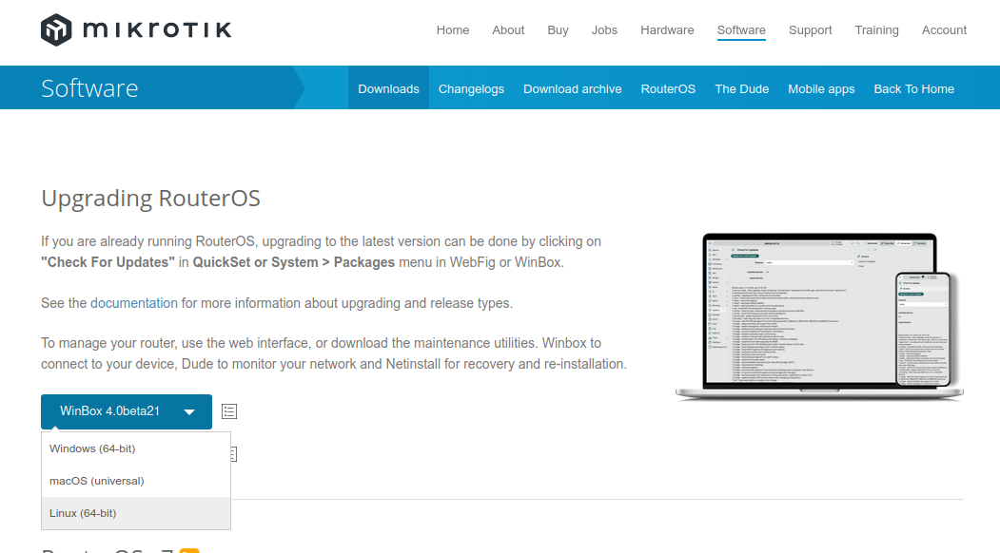
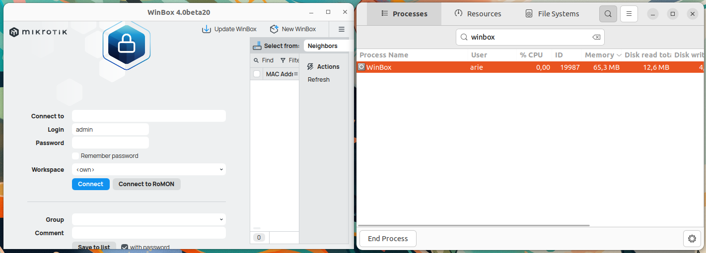

# Instalasi Winbox
WinBox adalah aplikasi yang digunakan untuk mengelola router MikroTik melalui antarmuka grafis di platform Windows. Namun, WinBox juga dapat dijalankan di sistem operasi Linux, seperti Ubuntu, dengan menggunakan Wine, yang memungkinkan menjalankan aplikasi Windows di Linux. WinBox menawarkan kemudahan dalam konfigurasi dan pemeliharaan router MikroTik, memberikan fitur seperti manajemen port, firewall, VPN, dan pengaturan jaringan lainnya secara lebih mudah dan efisien.
## Langkah-Langkah Instalasi
### 1. Unduh File Instalasi Winbox
Kunjungi https://mikrotik.com/download kemudian unduh file instalasi untuk sistem operasi Linux.


### 2. Ekstrak File ZIP Winbox
Karena file instalasi Winbox berekstensi ZIP, maka perlu di ekstrak terlebih dahulu. Pada terminal masuk ke direktori tempat file instalasi Winbox disimpan (biasanya terletak pada direktori Downloads), gunakan perintah berikut untuk berpindah direktori: 
```bash
cd Downloads/
```
Berikut adalah output jika telah berpindah direktori:
```bash
arie@zeno:~/Downloads$ 
```
Kemudian gunakan perintah berikut untuk melakukan ekstraksi file ZIP:
```bash
sudo unzip winbox-linux-x64.zip -d /opt/Winbox
```
Jika unzip berhasil outputnya akan seperti berikut:
```bash
Archive:  WinBox_Linux.zip
inflating: /opt/Winbox/WinBox      
creating: /opt/Winbox/assets/
creating: /opt/Winbox/assets/img/
inflating: /opt/Winbox/assets/img/winbox.png
```
### 3. Buat Shortcut Menu
Agar lebih praktis Winbox dapat ditambahkan ke menu aplikasi sehingga untuk mengaksesnya dapat langsung mengklik ikon Winbox pada menu aplikasi. Gunakan perintah berikut untuk membuat file winbox.desktop sekaligus mengedit isi filenya:
```bash
nano ~/.local/share/applications/winbox.desktop 
Kemudian isi dengan script berikut:
[Desktop Entry]
Name=Winbox
Exec=/opt/Winbox/winbox
Icon=/opt/Winbox/assets/img/winbox.png
Type=Application
Categories=Network; 
```

### 4. Verifikasi Instalasi
Winbox yang sudah terinstall dapat ditemukan pada menu Applications.
Berikut adalah Winbox ketika berjalan di Ubuntu 22.04 LTS.

