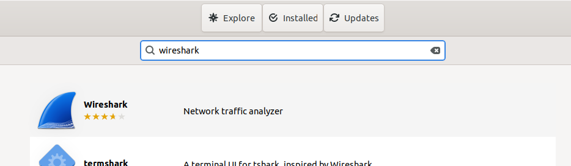
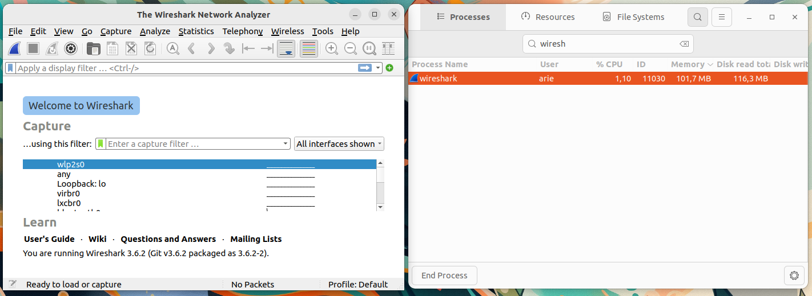

# Instalasi Wireshark
Wireshark adalah alat pemantauan jaringan open-source yang digunakan untuk menangkap dan menganalisis paket data yang melintasi jaringan komputer. Wireshark memungkinkan pengguna untuk memeriksa lalu lintas jaringan secara real-time, menganalisis protokol jaringan, serta mendeteksi masalah konektivitas dan performa. Wireshark mendukung berbagai protokol jaringan seperti TCP, UDP, HTTP, DNS, dan banyak lagi.
## Langkah-Langkah Instalasi
### 1. Buka Ubuntu Software
Untuk membuka ubuntu software dapat mengklik icon ubuntu software pada menu applications.

### 2. Cari Wireshark
Klik icon search pada pojok kiri atas ubuntu software kemudian masukkan keyword "Wireshark".

### 3. Install Wireshark
Pilih software yang sesuai kemudian tekan tombol install.

### 4. Verifikasi Instalasi
Tunggu hingga proses instalasi selesai, Wireshark yang sudah terinstall dapat ditemukan pada menu Applications.
Berikut adalah Wireshark ketika berjalan di Ubuntu 22.04 LTS.

