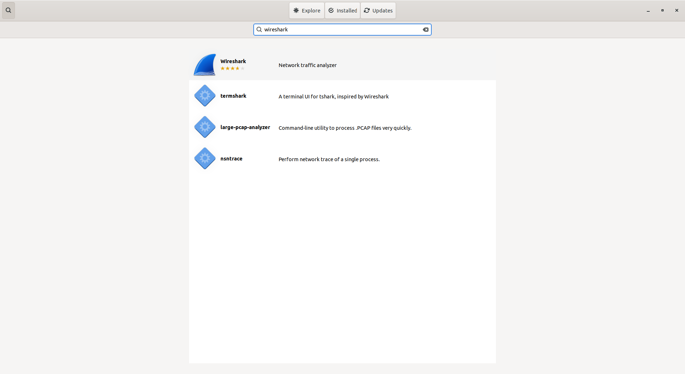
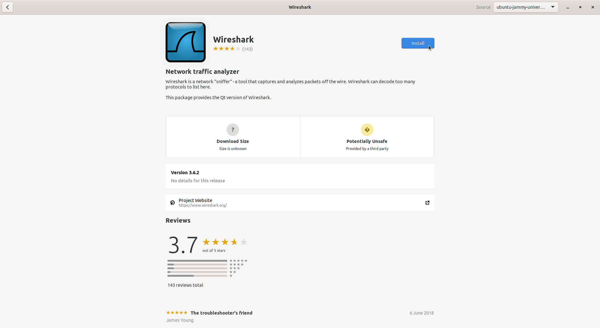

# Instalasi Wireshark

1. Buka ***Ubuntu Software***.
   
 

   

   

2. Klik ***icon*** ***search*** pada pojok kiri atas aplikasi kemudian masukkan *keyword* "*wireshark*".
   
 

   

   

3. Pilih aplikasi yang sesuai kemudian tekan tombol **install**.
   
 

   

   

4. Tunggu hingga proses instalasi selesai, *wireshark* yang sudah terinstall dapat ditemukan pada menu ***Applications***.
    
 

   

   
