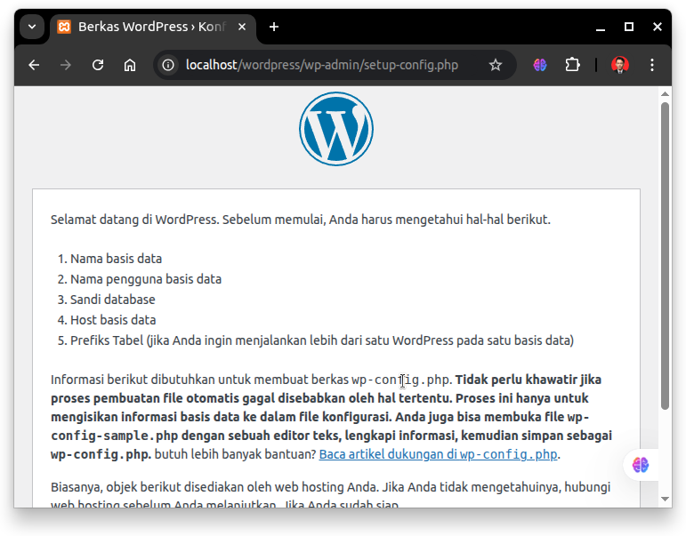

# Instalasi WordPress
WordPress adalah sistem manajemen konten (Content Management System/CMS) yang paling banyak digunakan di dunia. Aplikasi ini memungkinkan pengguna membangun dan mengelola situs web atau blog dengan mudah tanpa harus menulis kode dari awal. WordPress berbasis PHP dan MySQL/MariaDB, dan sangat fleksibel karena didukung oleh ribuan tema dan plugin. Untuk keperluan pengembangan lokal, WordPress bisa dijalankan di atas stack XAMPP.
## Langkah-Langkah Instalasi
### 1. Jalankan XAMPP
Gunakan perintah berikut untuk menjalankan XAMPP.
```bash
sudo ./xampp-linux-x64-8.0.30-0-installer.run
```
Kemudian pada jendela XAMPP jalankan service Apache Web Server dan MySQL Database.


### 2. Unduh WordPress
Kunjungi https://wordpress.org/download/ kemudian unduh file instalasi untuk sistem operasi Linux. File yang didownload berekstensi .zip.

### 3. Ekstrak WordPress
Pada terminal masuk ke direktori tempat file instalasi Wordpress disimpan (biasanya terletak pada direktori Downloads), gunakan perintah berikut untuk berpindah direktori: 
```bash
cd Downloads/
```
Berikut adalah output jika telah berpindah direktori:
```bash
arie@zeno:~/Downloads$ 
```
Kemudian gunakan perintah berikut untuk mengekstrak file wordpress:
```bash
unzip wordpress-6.8.1-id_ID.zip
```
Pindahkan folder hasil ekstraksi ke direktori XAMPP:
```bash
sudo mv wordpress /opt/lampp/htdocs/
```

### 4. Konfigurasi Wordpress
Untuk mengakses wordpress kunjungi http://localhost/wordpress pada browser.



Kemudian silahkan konfigurasi wordpress sesuai kebutuhan.
