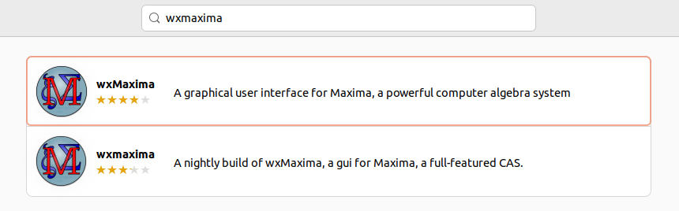
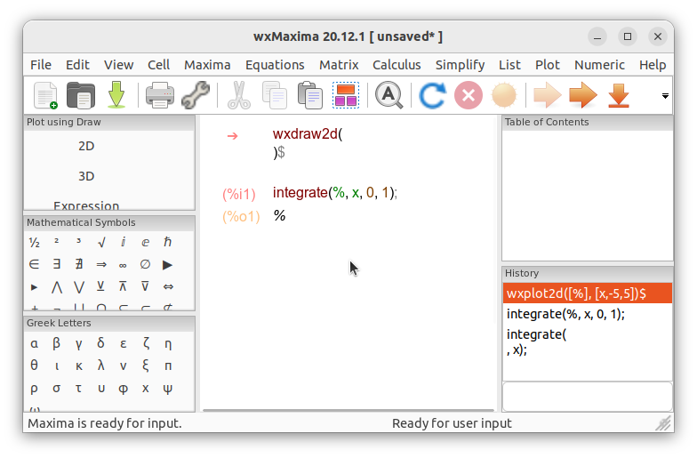

# Instalasi WxMaxima
wxMaxima adalah antarmuka grafis berbasis wxWidgets untuk Maxima, sebuah sistem aljabar komputer (Computer Algebra System/CAS) yang digunakan untuk melakukan perhitungan simbolik dan numerik. wxMaxima mempermudah pengguna dalam menggunakan Maxima melalui antarmuka GUI, yang mendukung input persamaan, tampilan hasil dalam bentuk matematis, grafik 2D/3D, serta kemampuan scripting. Aplikasi ini sangat cocok digunakan untuk pembelajaran matematika, kalkulus, aljabar, hingga komputasi teknik.
## Langkah-Langkah Instalasi
### 1. Buka Ubuntu Software
Untuk membuka ubuntu software dapat mengklik icon ubuntu software pada menu applications.

### 2. Cari WxMaxima
Klik icon search pada pojok kiri atas ubuntu software kemudian masukkan keyword "WxMaxima".

### 3. Install WxMaxima
Pilih software yang sesuai kemudian tekan tombol install.

### 4. Verifikasi Instalasi
Tunggu hingga proses instalasi selesai, WxMaxima yang sudah terinstall dapat ditemukan pada menu Applications.
Berikut adalah WxMaxima ketika berjalan di Ubuntu 22.04 LTS.

