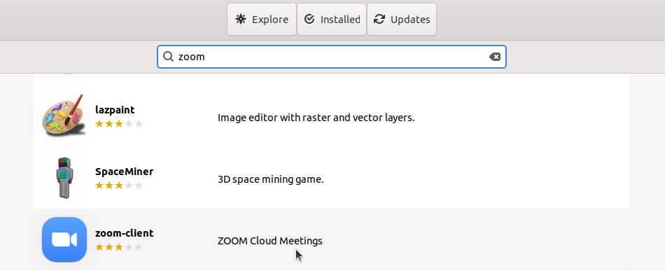
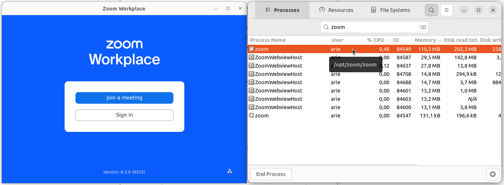

# Instalasi Zoom
Zoom adalah platform komunikasi video populer yang mendukung pertemuan daring, webinar dan konferensi. Zoom sangat banyak digunakan dalam lingkungan pendidikan termasuk pembelajaran jarak jauh, kuliah online, serta presentasi skripsi. Ketersediaan aplikasi Zoom untuk Linux termasuk Ubuntu memungkinkan pengguna di platform ini tetap dapat mengikuti kegiatan akademik secara penuh.
## Langkah-Langkah Instalasi
### 1. Buka Ubuntu Software
Untuk membuka ubuntu software dapat mengklik icon ubuntu software pada menu applications.

### 2. Cari Zoom
Klik icon search pada pojok kiri atas ubuntu software kemudian masukkan keyword "Zoom".

### 3. Install Zoom
Pilih software yang sesuai kemudian tekan tombol install.

### 4. Verifikasi Instalasi
Tunggu hingga proses instalasi selesai, Zoom yang sudah terinstall dapat ditemukan pada menu Applications.
Berikut adalah Zoom ketika berjalan di Ubuntu 22.04 LTS.

