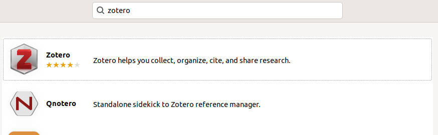
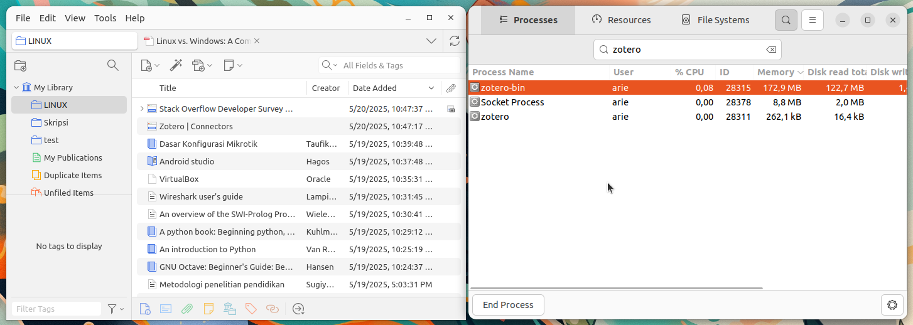

# Instalasi Zotero
Zotero adalah perangkat lunak manajemen referensi open-source yang digunakan oleh peneliti, mahasiswa, dan akademisi untuk mengelola sumber referensi dalam penelitian. Dengan Zotero, pengguna dapat menyimpan, mengorganisir, mengutip, dan berbagi referensi dari berbagai sumber seperti jurnal akademik, buku, dan situs web.
Zotero mendukung berbagai format sitasi seperti APA, MLA, Chicago, dan IEEE, serta dapat diintegrasikan dengan pengolah kata seperti LibreOffice, Microsoft Word, dan Google Docs.
## Langkah-Langkah Instalasi
### 1. Buka Ubuntu Software
Untuk membuka ubuntu software dapat mengklik icon ubuntu software pada menu applications.

### 2. Cari Zotero
Klik icon search pada pojok kiri atas ubuntu software kemudian masukkan keyword "Zotero".

### 3. Install Zotero
Pilih software yang sesuai kemudian tekan tombol install.

### 4. Verifikasi Instalasi
Tunggu hingga proses instalasi selesai, Zotero yang sudah terinstall dapat ditemukan pada menu Applications.
Setelah selesai menginstall Zotero, ketika membuka software LibreOffice secara otomatis akan muncul jendela wizard untuk menambahkan extension zotero ke LibreOffice.
Berikut adalah Zotero ketika berjalan di Ubuntu 22.04 LTS.

