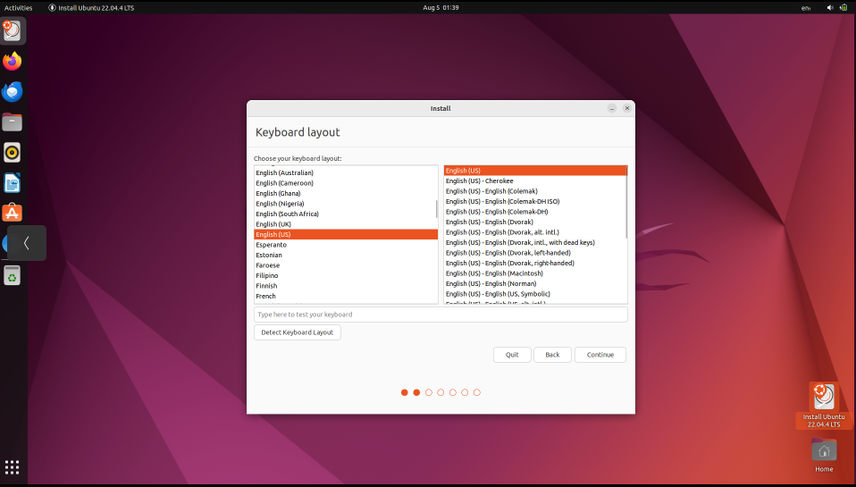
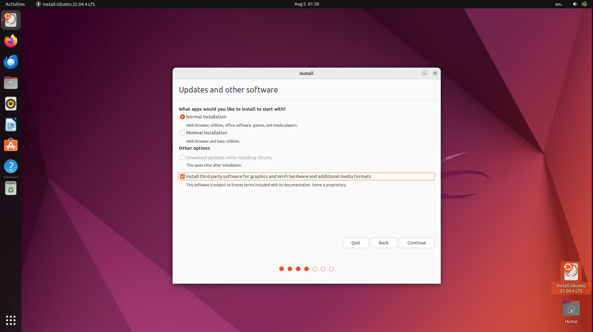

## Langkah-Langkah Instalasi Sistem Operasi Ubuntu

1. **Booting dari USB** 
   - Sambungkan USB bootable ke Laptop/PC.
   - Restart komputer dan masuk ke BIOS/UEFI dengan menekan tombol seperti F2, F12, atau Del. Tombol akses BIOS/UEFI dapat dilihat pada tabel berikut :  
  
     | Merk Laptop/PC | Tombol Akses |
     | :----: | -----|
     | Acer   | F1, F2, atau CTRL+ALT+ESC   |
     | ASUS   | f2   |
     | Axioo   | f2   |
     | Dell   | F2, Del, F12, F1, F3, atau Fn+F1   |
     | Fuijitsu   | f2   |
     | HP/Compaq   | ESC, F10, atau F1   |
     | Lenovo   | F2 atau Fn+F2   |
     | MSI   | Del   |
     | Samsung   | f2   |
     | Sony Vaio   | F1, F2, atau F3   |
     | Toshiba   | F2, ESC+F1, atau F2+power   |
     | Zyrex   | Del atau Esc   |

   - Ubah urutan booting agar USB menjadi prioritas pertama.
   - Simpan pengaturan dan keluar dari BIOS/UEFI.

2. **Memulai Instalasi** 
   - Setelah komputer melakukan booting dari USB, pilih Install Ubuntu.
     
 

     

     

   - Pilih bahasa yang akan digunakan dan klik Continue.
  
3. **Pengaturan Instalasi** 
   - Keyboard Layout: Pilih tata letak keyboard yang sesuai dan tekan Continue.
     
 

     

     

   - Updates and Other Software: Pilih apakah ingin menginstall pembaruan dan perangkat lunak pihak ketiga selama instalasi seperti codec multimedia.
     
 

     

     

   - Installation Type : 
     - Install Ubuntu alongside [OS lama] untuk dual boot.
     - Erase disk and install Ubuntu untuk menggantikan sistem operasi yang ada.
     - Something else untuk membuat kustomisasi partisi instalasi secara  manual.
     
 

     

     

     Klik Install Now untuk memulai proses instalasi.
   - Time Zone: Pilih zona waktu sesuai lokasi dan klik Continue.
     
 

     

     

4. **Konfigurasi Pengguna** 
   - Masukkan nama pengguna dan password yang diinginkan.
   - Pilih metode login, apakah otomatis atau manual kemudian klik Continue.
     
 

     

     

5. **Proses Instalasi dan Penyelesaian** 
   - Setelah semua pengaturan selesai, proses instalasi akan dimulai.
     
 

     

     

   - Tunggu hingga instalasi selesai. Setelah itu klik Restart Now.
   - Lepaskan USB ketika komputer melakukan restart.
