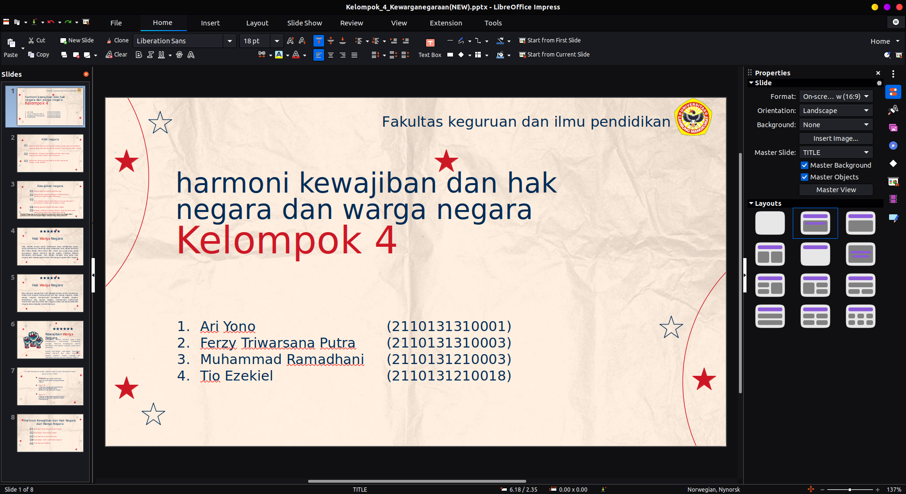

# Mata Kuliah Pengantar Pendidikan
## Kebutuhan Perangkat Lunak
- LibreOffice

## Hasil Uji Coba
### - Membuat Presentasi Menggunakan LibreOffice Impress

[Unduh file](../matkul/img/Kewarganegaraan/Kelompok_4_Kewarganegaraan(NEW).pptx)

# Kesimpulan
LibreOffice Impress pada sistem operasi Ubuntu berfungsi dengan baik untuk membuat presentasi materi mata kuliah **Pengantar Pendidikan**. Tidak ditemukan kendala selama proses uji coba dalam pembuatan file presentasi.