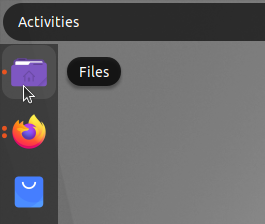
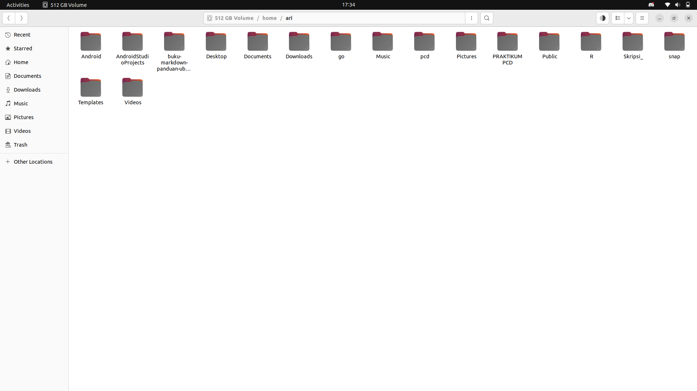
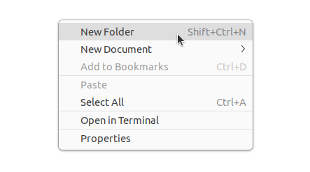
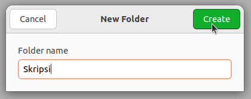
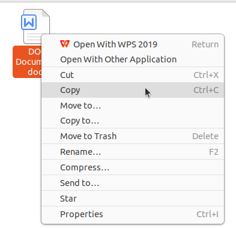
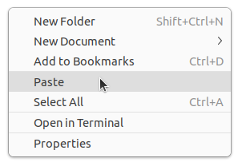
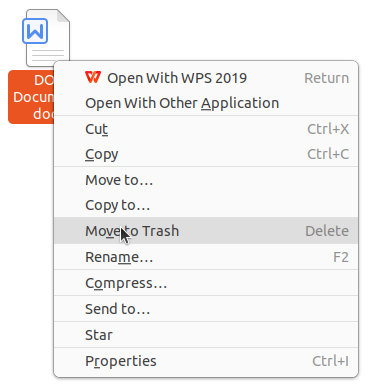
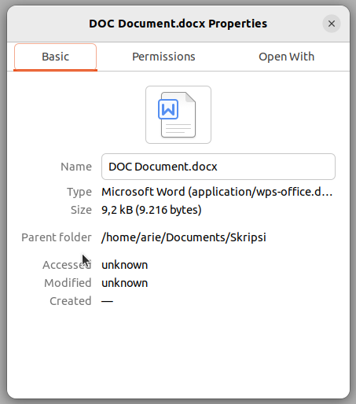

# Penggunaan File Manager

Ubuntu menyertakan file manager grafis yang bernama Nautilus. Nautilus adalah aplikasi yang memungkinkan pengguna untuk mengelola file dan folder secara visual mirip seperti Windows Explorer. Dengan Nautilus pengguna dapat dengan mudah mengelola file dan folder tanpa perlu mengetik perintah di terminal.

Untuk membuka Nautilus klik ikon Files yang terletak pada Dock di sisi layar.

 

   

Alternatif lainnya tekan tombol Super (biasanya bergambar logo Windows pada keyboard) kemudian ketik “Files” atau “Nautilus” pada kolom pencarian aplikasi kemudian tekan Enter.

Setelah terbuka Nautilus akan menampilkan struktur direktori dan file yang dapat dikelola dengan mudah melalui klik atau pintasan keyboard.

 

   

## Membuat Folder Baru

Untuk membuat folder baru buka Nautilus dan navigasikan ke lokasi tujuan, misalnya direktori Documents. Klik kanan pada area kosong lalu pilih menu New Folder. 

 

   

Setelah itu sebuah folder baru akan muncul dan dapat langsung diberi nama sesuai kebutuhan. 

 

   

Pembuatan folder juga dapat dilakukan dengan lebih cepat menggunakan kombinasi tombol `Ctrl + Shift + N`. Membuat folder baru berguna untuk mengelompokkan file berdasarkan jenis atau topik tertentu sehingga organisasi dokumen menjadi lebih terstruktur.

## Menyalin atau Memindahkan File

Untuk menyalin file klik kanan file tersebut lalu pilih Copy, sedangkan untuk memindahkan file pilih Cut.

 

   

Setelah itu buka folder tujuan kemudian klik kanan dan pilih Paste.

 

   

Operasi ini juga dapat dipercepat menggunakan shortcut `Ctrl + C` untuk menyalin, `Ctrl + X` untuk memotong, dan `Ctrl + V` untuk menempelkan file.

## Memindahkan File Menggunakan Drag and Drop

File atau folder dapat dipindahkan dengan mudah menggunakan teknik drag and drop. Buka satu lagi jendela Nautilus sebagai lokasi kemudian pilih file yang diinginkan, tekan dan tahan klik kiri lalu seret file tersebut ke lokasi tujuan kemudian lepaskan.

## Menghapus File

Menghapus file dalam Nautilus dapat dilakukan dengan klik kanan pada file dan memilih opsi Move to Trash. 

 

   

Untuk kepraktisan file juga dapat langsung dipindahkan ke Trash dengan menekan tombol Delete pada keyboard. File yang dihapus tidak langsung hilang melainkan disimpan sementara di dalam direktori Trash hingga benar-benar dihapus permanen. Jika ingin menghapus file secara permanen dapat menggunakan shortcut `Shift + Delete`.

## Melihat Detail File

Untuk melihat rincian file seperti ukuran, jenis, lokasi, dan hak akses, klik kanan file atau folder lalu pilih Properties atau dapat menggunakan shortcut Alt + Enter.

 

   

## Menampilkan File dan Folder Tersembunyi
Untuk menampilkan file atau folder tersembunyi tekan kombinasi `Ctrl + H `saat berada di jendela Nautilus. File tersembunyi biasanya diawali dengan tanda titik (.). Tekan kembali `Ctrl + H` untuk menyembunyikannya.

## Kombinasi Tombol Nautilus
Setelah memahami berbagai fungsi dasar Nautilus sebagai pengelola file di Ubuntu penting juga untuk mengenal shortcut yang tersedia untuk mempercepat navigasi dan manajemen file. Shortcut ini mempermudah interaksi dengan file manager tanpa perlu banyak menggunakan mouse sehingga meningkatkan efisiensi kerja. Berikut ini adalah tabel shortcut penting yang dapat digunakan dalam Nautilus:

| No | Kombinasi Tombol | Fungsi |
| -- | ---------------- | ----- |
| 1 | Ctrl + N | Membuat jendela Nautilus baru |
| 2 | Ctrl + Shift + N | Membuat folder baru |
| 3 | Ctrl + C | Menyalin file atau folder |
| 4 | Ctrl + X | Memotong (cut) file atau folder |
| 5 | Ctrl + V | Menempel (paste) file atau folder |
| 6 | Delete | Mengirim file atau folder ke Trash |
| 7 | Shift + Delete | Menghapus file atau folder secara permanen |
| 8 | Ctrl + H | Menampilkan atau menyembunyikan file tersembunyi |
| 9 | Ctrl + F | Membuka kolom pencarian file atau folder |
| 10 | Alt + Enter | Melihat properti file atau folder |
| 11 | Alt + Up Arrow | Naik ke direktori induk |
| 12 | Alt + Left Arrow | Kembali ke direktori sebelumnya |
| 13 | Alt + Right Arrow | Maju ke direktori berikutnya |
| 14 | F2 | Mengganti nama (rename) file atau folder |
| 15 | Ctrl + L | Memunculkan path lokasi dalam bentuk teks |
| 16 | F9 | Menampilkan atau menyembunyikan panel sidebar |
| 17 | Tab | Menampilkan atau menyembunyikan panel sidebar |