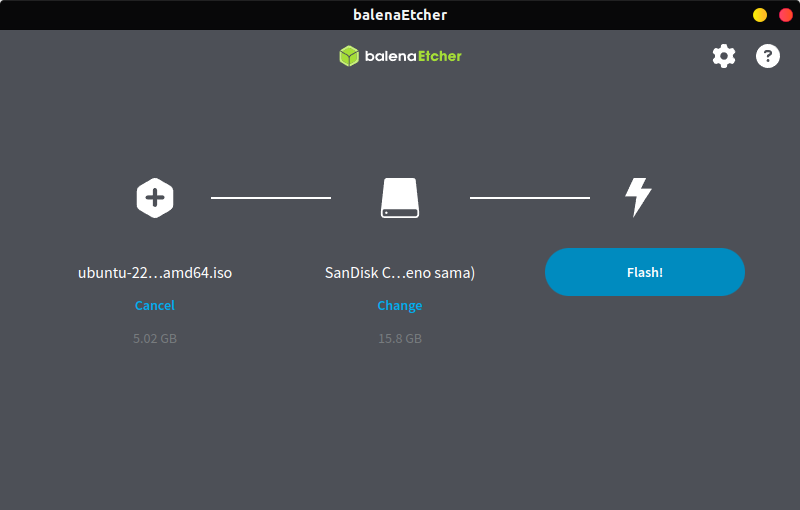

## Persiapan Instalasi
Sebelum melakukan instalasi, ada beberapa hal yang perlu disiapkan :
- **Spesifikasi Minimum:**
  - Prosesor : Dual-core 2 GHz
  - RAM : 4 GB (direkomendasikan 8 GB)
  - Penyimpanan : 25 GB ruang kosong
  - USB flash drive (minimal 8 GB)
  - Koneksi internet (opsional)

- **Mengunduh ISO Ubuntu:**
  1. Buka situs resmi Ubuntu di [http://ubuntu.com](http://ubuntu.com).
  2. Pilih Ubuntu desktop, misalnya Ubuntu Desktop 22.04 LTS.
  3. Klik link yang tersedia untuk mendapatkan file ISO.

  
    

  

  
 

- **Membuat Bootable USB**  
  #### Alat yang diperlukan untuk membuat bootable USB
  - Perangkat Lunak 
    - Etcher (tersedia untuk Windows, MacOS dan Linux), dapat didownload pada link berikut [etcher.balena.io](https://etcher.balena.io/)
  - Perangkat Keras
    - USB Flashdrive minimal 8 GB.

  #### Langkah-Langkah Membuat Bootable USB
  1. Sambungkan USB flash drive minimal 8 GB ke komputer.
  2. Buka aplikasi Etcher yang sudah diunduh dan diinstal.
  3. Pada tampilan utama Etcher, klik Select Image dan pilih file ISO Ubuntu yang telah diunduh.
  4. Klik Select Target dan pilih USB yang akan digunakan sebagai media instalasi.
  5. Klik Flash! untuk memulai proses pembuatan bootable USB.
       
 

       

       

    
  6. Tunggu hingga proses selesai, dan lepaskan USB setelah flash selesai.

