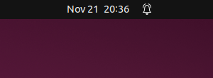
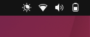

# Top Bar/Panel Atas

Top bar adalah panel horizontal yang berada di bagian atas layar. Fitur ini menampilkan jam dan tanggal di bagian tengah.

 

   

Kemudian di sisi kanan terdapat indikator baterai, volume, jaringan, dan menu sistem. Melalui menu ini pengguna dapat mengakses pengaturan, mengunci layar, logout, atau mematikan perangkat.

 

   

Top bar bersifat statis dan selalu tampak sehingga memudahkan pengguna untuk memantau status sistem.